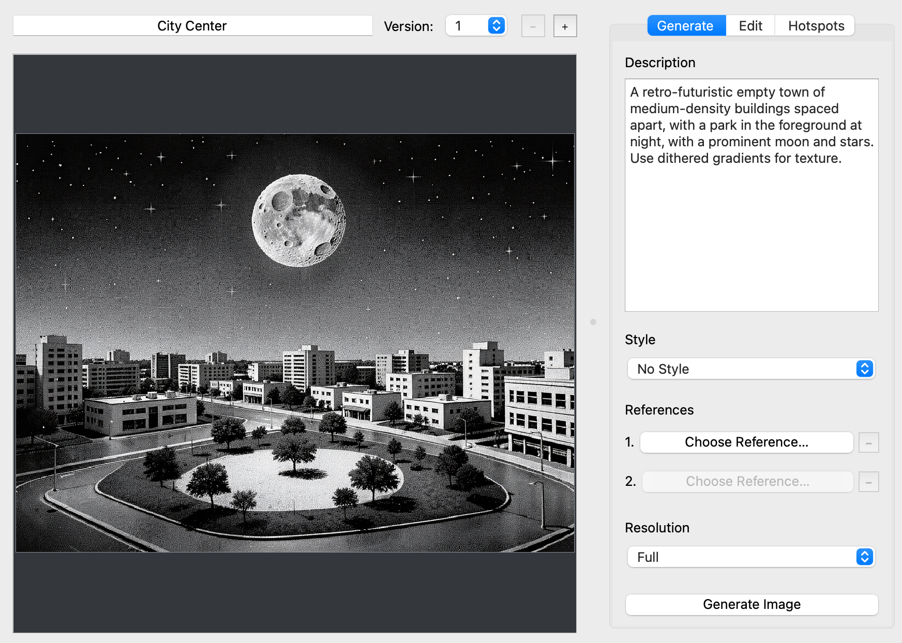
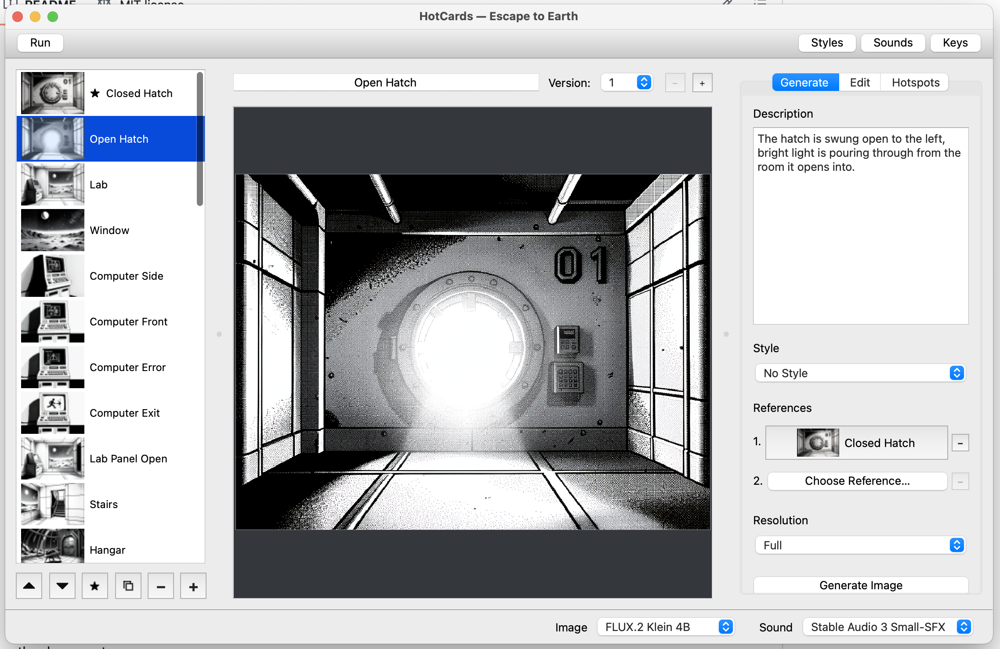
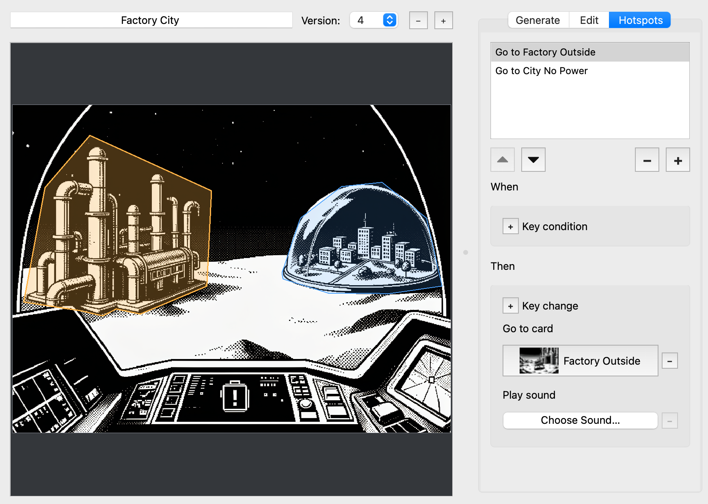
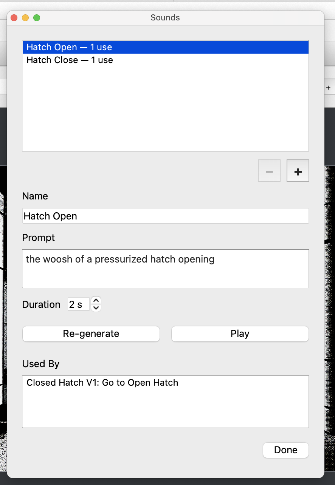
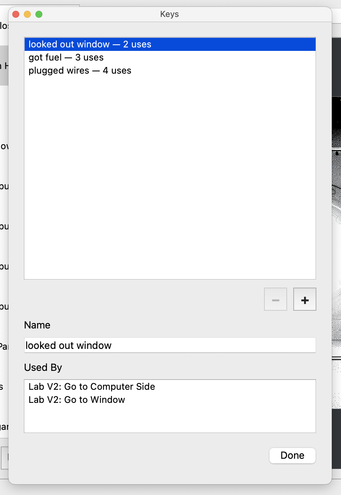
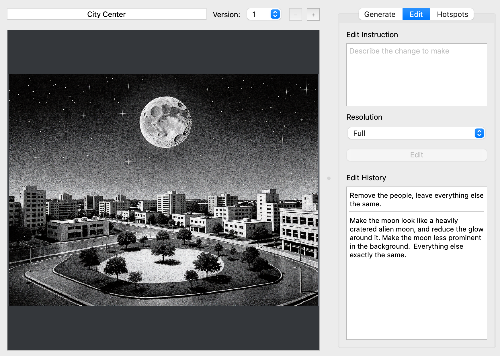
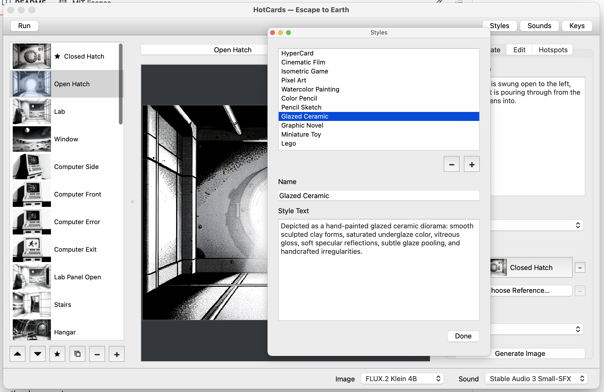
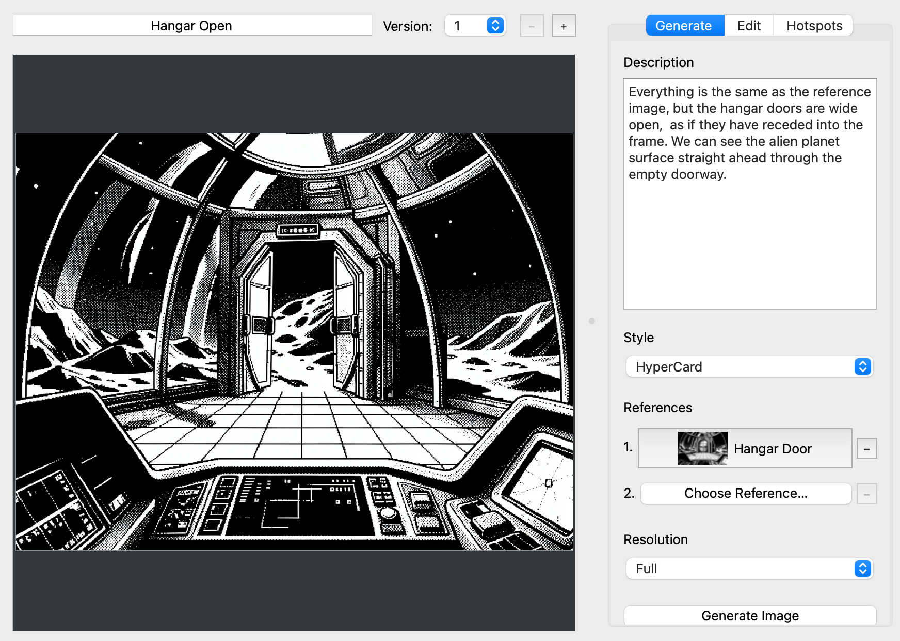

# HotCards


HotCards is a desktop app for creating interactive stories from connected cards,
inspired by HyperCard. It uses local image and sound generation models on Apple
Silicon Macs.

Describe a scene to generate its artwork, edit it with written instructions, and
add sound effects. Link cards through clickable hotspots that move between
scenes, play sounds, or change what happens next.

Keys let the story remember earlier actions. A hotspot can grant or remove a Key,
or require one before it works—for example, opening a door only after a switch
has been pressed. Combine these interactions to create branching stories,
explorable spaces, and puzzles, then try them in Run mode.

Everything runs locally. Prompts, source images, and generated assets stay on
your computer. No subscriptions are required.


## Setup and run

You'll need an Apple Silicon Mac. HotCards runs from source; there is no
packaged installer. You can still work on cards and interactions when a
generation model is unavailable.

Install Python 3.12 and [uv](https://docs.astral.sh/uv/), then run these commands
from the repository folder:

```sh
uv sync
uv run hotcards
```

Before generating images or sounds, download the required model files to your
local Hugging Face cache. Choose your models from the **Image** and **Sound**
menus at the bottom of the window. HotCards remembers these choices on your
Mac, not in the story.

| Purpose | Supported models |
|---|---|
| Images | FLUX.2 Klein 4B; FLUX.2 Klein 9B KV |
| Sound effects | Stable Audio 3 Small-SFX, using the optimized MLX weights |

For FLUX.2 Klein 9B KV, you'll need both the regular 9B model for generation
without References and the 9B KV model for References and editing. FLUX.2 Klein
4B uses Apache 2.0; the 9B models use the FLUX Non-Commercial License.

For sounds, use the Small-SFX model files from
`stabilityai/stable-audio-3-optimized`. Accept the model's terms and sign in to
Hugging Face outside HotCards to access the files. HotCards does not save your
credentials in stories or application settings.

Sound generation uses an attributed
[MIT-licensed subset](src/hotcards/vendor/stable_audio_3_mlx/NOTICE) of Stability
AI's official MLX implementation. Review each model's license before using it.

## Make your first story

This example uses two cards: a closed hatch and the laboratory behind it.
You'll connect them, then add a control panel that must be clicked before the
hatch will work.

The screenshots are from *Escape to Earth* and show the same tools on several
scenes. Your card names and generated images will differ.

### Create a stack

Choose **Create New Stack** in the welcome window and give it a name.
Choose a format for your cards: Square, Landscape, Portrait, or Widescreen.
Landscape is a good starting point. The format applies to the whole stack and
cannot be changed later.

Confirm your choices, then choose where to save the stack. It is saved as a
`.hotcards` folder that holds the story's cards, images, and sounds.

### Create the first scene

Rename the first card `Closed Hatch` using the name field above the image.
In the **Generate** tab, enter a Description such as:

> A spaceship corridor with a closed circular hatch and a small control panel
> on the wall beside it. View the hatch and panel straight on.

Keep the default HyperCard Style and Medium resolution, then press
**Generate Image**. When the image is ready, choose **Keep**. If it isn't what
you wanted, adjust the Description and generate again.



*Describe the scene, choose its Style and resolution, then generate the image.*

### Add another scene

Press `+` below the card list and name the new card `Lab`.
Under **References** in Generate, choose `Closed Hatch` as the first Reference.
Then describe the new scene:

> A laboratory inside the spaceship shown in image 1, with workbenches,
> scientific instruments, and a window looking out into space.

Generate the image and choose **Keep**.

References help connect the look of your scenes. You can use up to two other
cards; call them `image 1` and `image 2` in your Description. The model receives
their images, not their card names or descriptions.



*Here, Open Hatch uses Closed Hatch as a Reference to create another view of
the same place.*

### Link the cards

Return to `Closed Hatch` and open **Hotspots**. Press `+` in the hotspot list,
then click around the edge of the hatch to outline a clickable area.
After placing at least three points, click the first point to finish.
Press Escape if you need to cancel and start again.

With the hotspot selected, find **Go to card** under **Then** and choose `Lab`.
Press **Run** and click the hatch: it should take you to the laboratory.
Press **Author** to return to editing.



*Outline the part of the picture people should click, then choose its
destination under Go to card. This scene offers two routes.*

### Add a sound

Open **Sounds** from the toolbar and press `+`. Name the sound `Unlock`,
set its duration to two seconds, and enter a prompt:

> A short mechanical click followed by a heavy metal bolt sliding open.

Press **Generate**, then **Play** to listen. Adjust the prompt and generate
again if needed. Close the Sounds window when you're happy with it; the sound
is now available to use on any hotspot in the stack.



*Describe the effect and use Play to listen. Used By shows which hotspots
already use the sound.*

### Make the hatch depend on the control panel

Open **Keys** from the toolbar, press `+`, and name the Key `Hatch Unlocked`.
Close the window. This Key will remember whether the player has used the panel.



*Give Keys names that describe what the player has done. Select one to see
which hotspots use it.*

On `Closed Hatch`, draw a second hotspot around the control panel.
Under **Then**, add a **Key change**, choose `Hatch Unlocked`, and set it to
**Gain**. Under **Play sound**, choose `Unlock`. Leave **Go to card** empty
so clicking the panel keeps the player in the corridor.

Select the hatch hotspot again. Under **When**, add a **Key condition**,
choose `Hatch Unlocked`, and set it to **Has**. Keep its destination set to `Lab`.

The panel now gives the player a Key, and the hatch only works when they have
it. Use **Lose** to remove a Key or **Lacks** to make a hotspot work only when
the player does not have it. Keys are simply present or absent; they do not
hold numbers or other values.

### Test the interaction

Select `Closed Hatch` and press **Run**. Try the hatch before touching the
panel—it should do nothing. Click the panel to hear the unlock sound, then
click the hatch to enter the laboratory.

Use **Back** to return to the corridor. The hatch stays unlocked because Back
keeps your Keys. Use **Restart** to return to the start card with no Keys and
try the puzzle again. The star in the card list marks the start card.

Run starts on whichever card you're editing, not necessarily the start card.
You can show hotspot outlines while testing to see where to click. Returning
to Author and entering Run again also starts with no Keys.

## Refine and expand your story

### Edit an image

Select a card with an image and open **Edit**. Describe a change, such as
"Make the control panel larger," then press **Edit**.
This changes the current image rather than starting a new scene from its
Description. Generate References are not used for Edit.

Choose **Keep** to use the result, **Undo** to go back, or **Create New Version**
to keep both versions. Switch between versions using the controls above the
image. Creating a version does not run the model again.

Hotspots stay in place when an image changes. Return to the Hotspots tab and
drag their shapes or points if they no longer line up with the picture.

Unfinished Edit instructions are saved with each version. To reuse an earlier
instruction, click it in **Edit History**, adjust the text if needed, and press
Edit. Selecting a history entry does not start generation.



*Use Edit to make specific changes. Edit History keeps the instructions used
on this image so you can recall them later.*

### Keep a consistent style

Choose a Style in Generate to set the look of a card. Open **Styles** from the
toolbar to change a Style's description or create your own, then select it on
the cards you want to use it.

Generate combines your Description with the selected Style. Edit also uses
the Style unless your instruction asks for a different visual treatment.
The last Style you choose becomes the default for new cards; choose
**No Style** if you want to work without one.



*Edit a Style's text here, then choose that Style on the cards you want to use it.*

### Choose an image size

Use Medium while trying out scenes, or choose another resolution in Generate.
Hover over a choice to see the exact dimensions for your stack's format.

| Size | Longer edge |
|---|---|
| Small | 256 px |
| Medium | 512 px |
| Large | 768 px |
| Full | 1024 px |

In Edit, keep the current image size or choose one of the larger options.
HotCards generates its own images; importing images is not supported.

### Add more paths

Use `+` below the card list to add a new scene, or **Command-D** to copy the
selected card's current version. A copy includes its image and hotspots, so
review the destinations and conditions before using it as a different scene.
To try a different version of the same scene instead, use the version controls
above the image.

Add more hotspots to offer different routes, play sounds, or change Keys.
A hotspot does not need a destination: it can just play a sound or change what
the player can do next. If you add several conditions, all must be met.

To show a visible change, such as a door opening, make another card using the
original as a Reference. Describe what changes in `image 1`, generate it, then
link to the new card from a hotspot.



*Hangar Open uses Hangar Door as a Reference to show the same scene with its
doors open.*

## Save your work

HotCards saves changes automatically, including generated images and sounds.
Use **Undo** to reverse an edit or deletion, and **Save As** to make an independent
copy of the stack.

Watch the notification bar for save or generation errors. If HotCards cannot
confirm a result was saved, it pauses further changes until saving succeeds.
Your unfinished Edit instructions are saved too, so you can return to them
after closing the stack.

To reopen a story, choose it in the welcome window or use Open to find its
`.hotcards` folder. The welcome window lists stacks in `~/Documents/HotCards`.
Keep the whole folder together when copying or moving a story.

## Development and evaluation

Run the tests and code checks with:

```sh
uv run pytest
uv run ruff check .
uv run ruff format .
```

Automated tests use fakes and do not run or download models. To check generation
with real models, run an evaluation:

```sh
uv run hotcards-eval smoke
uv run hotcards-eval images
uv run hotcards-eval style-presets --validate-only
uv run hotcards-eval style-presets
uv run hotcards-eval flux-references --stack /path/to/Stack.hotcards
```

Evaluation cases are in `evals/cases/`. Each run saves its inputs, progress, and
results in a new folder under `evals/runs/`. Reports show prompts, outputs,
timings, and failures, and can be built offline. Run output is not tracked in
Git. `style-presets --validate-only` checks the cases without running a model.

| Package | Responsibility |
|---|---|
| `domain/` | Story data, geometry, and validation |
| `storage/` | Saving stacks and safely managing their files |
| `application/` | Document state, commands, Undo/Redo, and background work |
| `generation/` | Preparing prompts and running local models |
| `ui/` | PySide6 Author and Run interface |
| `evaluation/` | Evaluating models through the same code used by the app |

Image and sound models load and run one at a time on a shared thread.
The app and evaluations use the same model adapters.
See [AGENTS.md](AGENTS.md) for contributor guidance.

## License

HotCards source code is available under the [MIT License](LICENSE).
The vendored Stable Audio MLX components retain Stability AI's
[MIT license](src/hotcards/vendor/stable_audio_3_mlx/LICENSE) and
[attribution](src/hotcards/vendor/stable_audio_3_mlx/NOTICE).

Dependencies and model weights are subject to their own licenses. Model weights
are not included in this repository. In particular, FLUX.2 Klein 9B uses the
FLUX Non-Commercial License; HotCards' MIT license does not override model
licenses or terms governing generated output.
