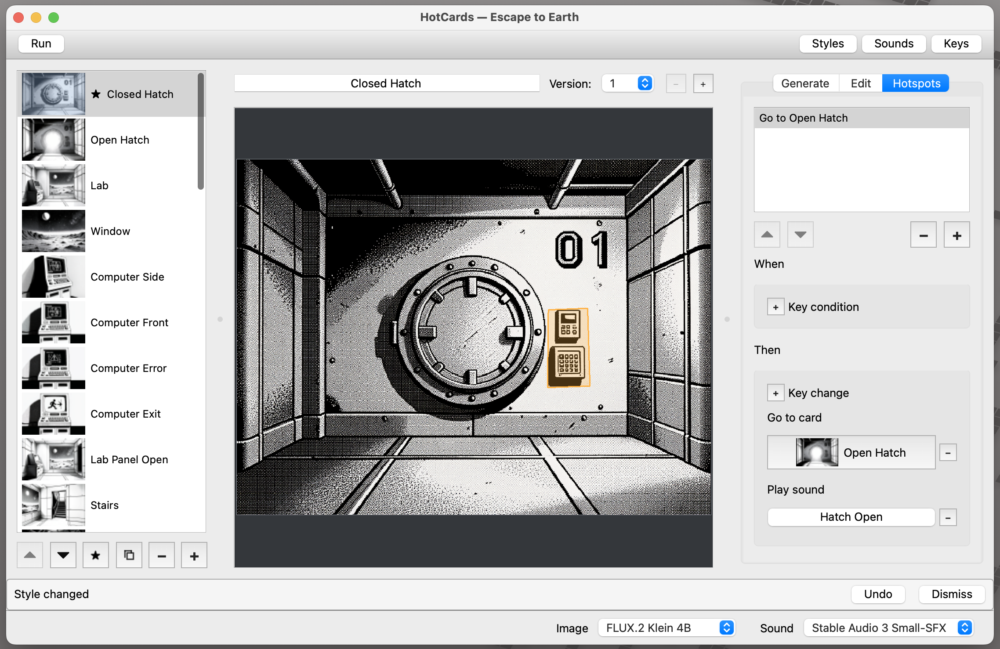

# HotCards


HotCards is a desktop app for creating interactive stories from connected cards,
inspired by HyperCard. It uses local image and sound generation models on Apple
Silicon Macs.

Describe a scene to generate its artwork, edit it with written instructions, and
add sound effects. Link cards through clickable hotspots that move between
scenes, play sounds, or change what happens next.

Keys let the story remember earlier actions. A hotspot can grant or remove a Key,
or require one before it works—for example, opening a door only after a switch
has been pressed. Combine these interactions to create branching stories,
explorable spaces, and puzzles, then try them in Run mode.

Everything runs locally. Prompts, source images, and generated assets stay on
your computer. No subscriptions are required.



## Setup and run

**Platform:** Apple Silicon macOS. HotCards runs from source; there is no
packaged installer. The authoring interface remains usable when a generation
model is unavailable.

Install Python 3.12 and [uv](https://docs.astral.sh/uv/), then run:

```sh
uv sync
uv run hotcards
```

Generation requires locally cached model weights. Select models using the
right-aligned **Image** and **Sound** pickers in the bottom bar, alongside rendering
progress; selections are saved on the machine, not in a stack.

| Purpose | Supported models |
|---|---|
| Images | FLUX.2 Klein 4B; FLUX.2 Klein 9B KV |
| Sound effects | Stable Audio 3 Small-SFX, using the optimized MLX weights |

The 9B KV choice requires regular 9B weights for text-only generation and
9B KV weights for Reference-backed generation and Edit. FLUX.2 Klein 4B uses
Apache 2.0; the 9B models use the FLUX Non-Commercial License.

For Sound generation, cache the Small-SFX weights from
`stabilityai/stable-audio-3-optimized`. Accept the model's terms and authenticate
with Hugging Face outside HotCards. Credentials are not stored in stack bundles
or application settings.

Sound inference uses an attributed
[MIT-licensed subset](src/hotcards/vendor/stable_audio_3_mlx/NOTICE) of Stability
AI's official MLX implementation. Model weights have separate license terms;
review them before use.

## Cards and revisions

Stacks are self-contained `.hotcards` directory bundles containing their
document and generated assets. The welcome window lists stacks in
`~/Documents/HotCards` and provides Open, Create, and permanent Delete actions.
Permanent stack deletion requires confirmation.

Choose a stack format at creation: **Square 1:1**, **Landscape 4:3**,
**Portrait 3:4**, or **Widescreen 16:9**. Landscape is the default. A stack's
format is fixed.

The Cards sidebar creates a blank card immediately after the selection.
**Command-D** duplicates the selected card's active revision into an independent
card, including its image, hotspots, References, Style, and Generate resolution.
Self-navigation points to the duplicate; other destinations are preserved.

Each card has at least one numbered revision. A revision contains its
Description, Style selection, optional generated background, ordered References,
Generate resolution, hotspots, and Edit draft. The header above the canvas
selects, duplicates, and deletes revisions. Duplicating a card or revision starts
its Edit draft empty.

## Generate and Edit

The inspector has three tabs: **Generate**, **Edit**, and **Hotspots**.
Generate and Edit work on the selected card revision and replace its background
in place. Backgrounds are generated in HotCards; image import is not supported.

| | Generate | Edit |
|---|---|---|
| Text input | A nonempty Description | A nonempty Edit Instruction |
| Image input | Up to two optional Reference cards | The current background |
| Style | Selected Style text follows the Description | Selected Style text follows the instruction unless the instruction explicitly changes the visual treatment |
| Resolution | Every named tier | Valid current dimensions and named tiers with greater pixel area |
| Edit History | Starts empty | Appends the accepted instruction |

Prompts are composed deterministically, without a language model rewriting
them. Edit sends the exact trimmed instruction and applicable Style text, with
no additional guidance. It never sends the Description or Generate References.
The effective Edit prompt must fit the model's 512-token budget; it is not
truncated. Each Edit uses a fresh random seed.

### References and resolution

Choose Reference cards in the searchable thumbnail picker. Their order matters:
refer to them as **`image 1`** and **`image 2`** in the Description. Each
Reference's active background is sent exactly once, in that order. Card names
and source-card descriptions are not added to the prompt. Clearing the first
Reference promotes the second. Self-references and duplicate References are
not allowed.

Resolution tiers name the image's long edge:

| Small | Medium | Large | Full |
|---|---|---|---|
| 256 px | 512 px | 768 px | 1024 px |

The stack format determines the other edge, rounded to a multiple of 16 pixels.
For example, Landscape Full is 1024 × 768 and Widescreen Full is 1024 × 576.
Exact dimensions appear in selector tooltips. New cards default to Medium;
duplicated cards and revisions retain their source's Generate resolution.
Edit defaults to the current image's decoded dimensions when they are aligned
and compatible with the stack format.

Entering a card, revision, or replacement image selects its current size.
An aligned, format-compatible non-preset image has a **Current** row.
Ordinary refreshes preserve deliberate resolution choices.

### Results, drafts, and history

Completed Generate and Edit operations offer **Create New Version**, **Undo**,
and **Keep**. Keep leaves the result on the current revision. Create New Version
restores the prior complete revision and activates a new revision containing
the result, without generating another image.

Version creation is a separate Undo step: its first Undo leaves the result on
the original revision; the next Undo reverses the image operation.

Edit drafts autosave per revision and survive navigation, reopening, Save As,
and mode changes. Text editing has its own context-local Undo/Redo, separate
from document history. Undoing an accepted Edit restores its instruction in
that revision unless newer input would be overwritten.

Edit History shows the active image's accepted authored instructions, oldest
first, including repeated instructions and those inherited through duplication.
Click a row, or select it and press Enter or Space, to recall its exact text
without changing the image or starting generation.

## Styles, Sounds, and Keys

The Author toolbar opens stack-global **Styles**, **Sounds**, and **Keys**
managers. Each is a single modeless window that stays synchronized with the
document.

**Styles** are editable named prompt texts. New stacks start with HyperCard
selected and include a library of visual treatments. An explicit Style or
No Style selection becomes the default for new cards. Deleting a Style clears
its selections and is undoable.

**Sounds** are named effects with a generation prompt and a duration of
1–30 seconds, defaulting to two seconds. Generate or replace audio with
Stable Audio 3 Small-SFX, then preview it in the manager or Sound picker.
Generation uses Pingpong sampling, eight steps, CFG 1.0, and a fresh seed.
Assets are 44.1 kHz stereo 16-bit PCM WAVs. An existing Sound remains available
while its replacement is generated.

**Keys** are named binary flags that record what has happened during the
current Run session. They are either present or absent—there are no values,
counters, or expressions. Create Keys in the Keys manager, then use a hotspot's
**When** rules to require a Key to be present or absent and its **Then** rules
to **Grant** or **Remove** Keys.

For example, a control-panel hotspot can grant `Hatch Open`; a hatch hotspot
can require `Hatch Open` before navigating through it; and another action can
remove the Key to close the hatch again. This allows cards to react differently
as the player explores without storing runtime state in the authored stack.
Key and Sound names are case-insensitively unique. Renaming preserves references;
referenced Keys and Sounds cannot be deleted. Their managers list usages and
can jump to the corresponding hotspot.

## Hotspots and Run mode

With the Hotspots tab active, click empty canvas or press the inspector's `+`
to draw a polygon. Click its first vertex to close it after at least three
vertices. Escape or leaving the tab cancels an unfinished polygon without
changing the document.

Drag polygons or vertices, insert vertices along edges, and delete the selected
vertex or hotspot. Every saved hotspot has exactly one polygon. Replacing a
background preserves its hotspots for manual review.

A hotspot's **When** rules require specified Keys to be present or absent.
Its **Then** rules can remove Keys, grant Keys, navigate to a card, and play
one Sound. Key-only and Sound-only hotspots are valid. Hotspot labels describe
their highest-priority action.

Press **Run** to enter the current Author card. Run starts with no Keys.
Activation checks conditions, removes Keys, grants Keys, navigates, then starts
the selected Sound. Condition-failing and actionless hotspots are excluded from
hit testing. Overlapping eligible hotspots follow their ordering.

**Back** preserves Keys; **Restart** returns to the configured start card and
clears them. Leaving Run discards its state. New playback replaces the previous
Sound; navigation, Back, Restart, and leaving Run stop prior playback. A Sound
started by a hotspot can continue on its destination card.

The canvas fits and centers the complete image without cropping or stretching.
Hotspots follow the fitted image bounds; letterbox and pillarbox bars are
noninteractive. Run provides Back, Restart, and hotspot-overlay controls.

## Saving and Undo

Document changes autosave. Reversible authoring changes apply directly and
offer Undo; outcomes and failures appear in the notification bar. Field
validation appears beside its input.

Image and Sound replacements coordinate asset storage with the document save.
If a visible result's durability is uncertain, further mutations and normal
result actions wait for a successful save retry. Newer Edit drafts are never
cleared by delayed completion.

Generated assets remain available while the document or session Undo/Redo
history can restore them. Card duplication owns independent image bytes;
revision duplication can share immutable image bytes. Image origin records
retain exact prompts, execution settings, dimensions, and accepted Edit
instructions without depending on source cards remaining in the stack.
Save As creates an independent bundle.

## Development and evaluation

```sh
uv run pytest
uv run ruff check .
uv run ruff format .
```

Automated tests use fakes and do not invoke or download models. Live evaluations
are explicit:

```sh
uv run hotcards-eval smoke
uv run hotcards-eval images
uv run hotcards-eval style-presets --validate-only
uv run hotcards-eval style-presets
uv run hotcards-eval flux-references --stack /path/to/Stack.hotcards
```

Evaluation cases live in `evals/cases/`. Each live run writes an immutable
directory under `evals/runs/` with a checkpointed manifest and retained
artifacts. Reports summarize prompts, outputs, timing, and failures; rendering
a report is offline. Generated run output is not tracked in Git.

| Package | Responsibility |
|---|---|
| `domain/` | Strict document models, geometry, and validation |
| `storage/` | Bundle persistence and identity-bound asset ownership |
| `application/` | Authoritative document, commands, Undo/Redo, workflows, and workers |
| `generation/` | Prompt composition and local image/audio adapters |
| `ui/` | PySide6 Author and Run interface |
| `evaluation/` | Live evaluations using production schemas and adapters |

Image and Sound loading and inference share a serialized, process-local native
invocation boundary. Application and evaluation calls use the same adapters.
Contributor constraints and repository workflow are in [AGENTS.md](AGENTS.md).

## License

HotCards source code is available under the [MIT License](LICENSE).
The vendored Stable Audio MLX components retain Stability AI's
[MIT license](src/hotcards/vendor/stable_audio_3_mlx/LICENSE) and
[attribution](src/hotcards/vendor/stable_audio_3_mlx/NOTICE).

Dependencies and model weights are subject to their own licenses. Model weights
are not included in this repository. In particular, FLUX.2 Klein 9B uses the
FLUX Non-Commercial License; HotCards' MIT license does not override model
licenses or terms governing generated output.
